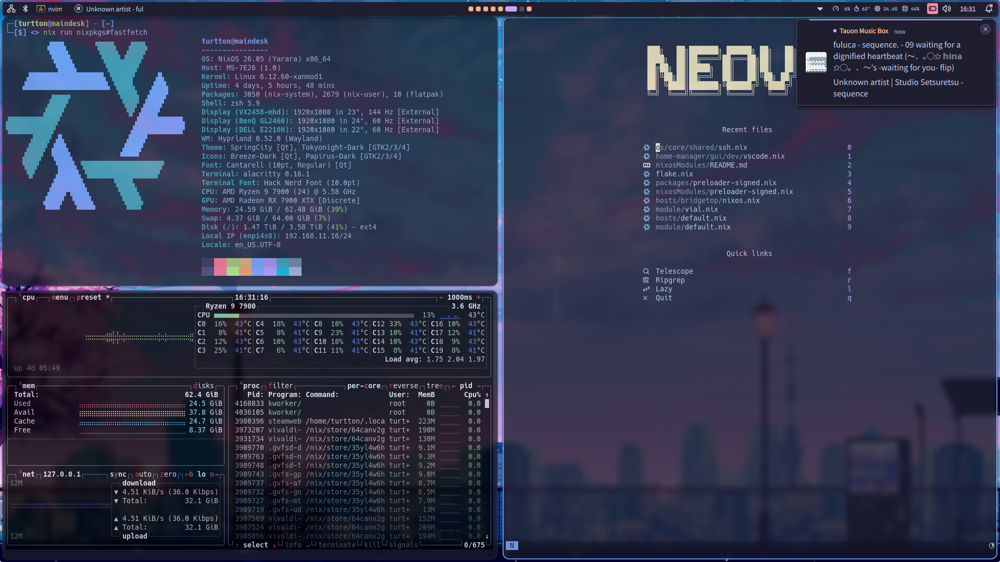

# dotnix

My dotfiles for NixOS

# [Hyprland](./home-manager/wm/hyprland/)



- Launcher/Bar/LockScreen: [noctalia-shell](https://github.com/noctalia-dev/noctalia-shell)
- Editor: [Neovim](https://github.com/turtton/myvim.nix)
- Terminal: [Alacritty](https://alacritty.org)
- ScreenShot: [Grimblast+swappy](https://github.com/turtton/dotnix/blob/8186fca772bfa4d22db9263a04c08541cfbeafa9/home-manager/wm/hyprland/key-bindings.nix#L102-L106)

> Article(JP): https://zenn.dev/watagame/articles/hyprland-nix

# Setup

1. Modify `/etc/nixos/configuration.nix`

   ```diff
   programs = {
   + git.enable = true;
   };
   + nix.settings.experimental-features = ["nix-command" "flakes"];
   ```

1. Run `sudo nixos-rebuild switch`

1. Clone this repository and move it

1. Run`nix develop`

1. Run `switch-nixos {name}`(or `sudo nixos-rebuild switch --flake .#{name}`)\
   Name: `virtbox` `maindesk` `bridgetop`

   > If you want to try my profile, use `virtbox` first(requires 75GB at least), and make sure [hardware-configuration.nix](https://github.com/turtton/dotnix/blob/main/hosts/virtbox/hardware-configuration.nix) is replaced your `/etc/nixos/hardware-configuration.nix` before running command.

1. ~~Run `nix run nixpkgs#home-manager -- switch --flake .#{name}`(`switch-home {name}`)~~

   > This method no longer needed, but settings still here to configure darwin system in the future.

1. Reboot

# NixOS Modules

This repository provides reusable NixOS modules. See [nixosModules/README.md](./nixosModules/README.md) for details.

Available modules:

- `preloader-signed` - UEFI Secure Boot with PreLoader

# References

> My environement log(JP):\
> https://zenn.dev/watagame/scraps/e64841d674d16e

- https://zenn.dev/asa1984/articles/nixos-is-the-best

- https://github.com/asa1984/dotfiles/blob/main

- https://nixos.wiki/wiki/

- https://search.nixos.org/packages

- https://mipmip.github.io/home-manager-option-search/

Hyprland themes:

- https://github.com/MrVivekRajan/Hypr-Dots/tree/Type-2?tab=readme-ov-file#spring-city
- (waybar) https://github.com/redyf/nixdots/tree/main/home/desktop/addons/waybar/tokyonight
